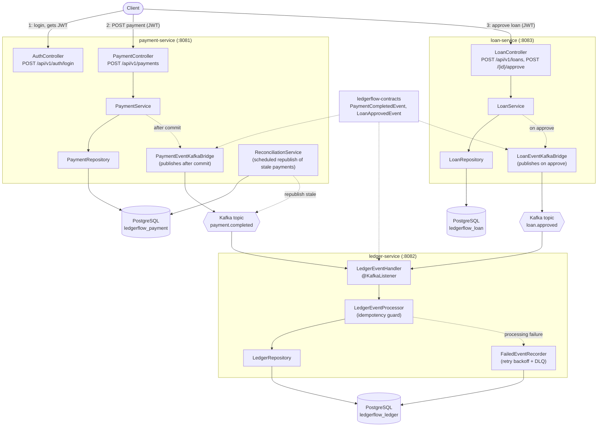

# 💸 LedgerFlow

**LedgerFlow** is a Java/Spring Boot learning project: a payment-and-ledger system that started
as a monolith and has since been split into three independently-deployable microservices —
`payment-service`, `ledger-service`, and `loan-service` — communicating only through Kafka. See
[spec.md](spec.md) for the full system design and [AGENTS.md](AGENTS.md) for repo conventions.

[](https://github.com/thanhphan20/ledger-flow/actions/workflows/maven.yml)
[](https://github.com/thanhphan20/ledger-flow/actions/workflows/docker-compose-e2e.yml)
[](https://github.com/thanhphan20/ledger-flow/actions/workflows/k8s-verify.yml)
[](https://opensource.org/licenses/MIT)

---

## 🚀 Key Features

- **Three decoupled microservices**, not a modular monolith: `payment-service`,
  `ledger-service`, and `loan-service` run as separate processes with separate databases and
  talk to each other only through Kafka — no shared JVM, no shared database, no synchronous
  calls between them.
- **Kafka event-driven integration**: `payment-service` publishes `PaymentCompletedEvent` to
  the `payment.completed` topic after its transaction commits; `loan-service` publishes
  `LoanApprovedEvent` to `loan.approved` when a loan is approved; `ledger-service` consumes
  both and posts ledger entries.
- **Idempotent, at-least-once processing**: duplicate/redelivered events are detected and
  safely no-op'd via a `ProcessedEvent` guard, so retries and reconciliation republishes can
  never double-post a ledger entry.
- **Kafka-native retry/DLQ**: failed messages retry with backoff, then land in a
  `failed_events` table instead of crashing the consumer.
- **Local dev via Docker Compose**: three Postgres instances, a single-node Kafka broker
  (KRaft mode, no Zookeeper), and a Kafdrop UI for inspecting topics.
- **JWT authentication on payment-service and loan-service**: `POST /api/v1/auth/login`
  authenticates a demo user and issues an HMAC-signed JWT; every other endpoint on those two
  services (except the health check) is a Spring Security OAuth2 resource server that
  validates that token.
- **Early Kubernetes support**: `k8s/` has manifests for the `ledger-flow` namespace and all
  three Postgres instances, applied to a real `kind` cluster and smoke-tested in CI.
- **Automated formatting**: Spotless + Google Java Format, enforced in `mvn verify`.

---

## 🛠️ Technology Stack

- **Core**: Java 21 (LTS)
- **Framework**: Spring Boot 4.0.5
- **Messaging**: Apache Kafka (via spring-kafka)
- **Database**: PostgreSQL (one instance per service)
- **Persistence**: Spring Data JPA / Hibernate
- **Security**: Spring Security OAuth2 Resource Server, JWT via Nimbus JOSE (`payment-service`,
  `loan-service`)
- **Tooling**: Maven (multi-module), Spotless, Lombok, Docker Compose, Kubernetes (`kind`,
  `kubectl`), GitHub Actions

---

## 🏗️ Architecture Overview

```
ledger-flow/
  pom.xml                  parent (Maven multi-module, no source of its own)
  ledgerflow-contracts/    shared Kafka event types (PaymentCompletedEvent, LoanApprovedEvent, EntryType)
  payment-service/         owns `payments`; Kafka producer; REST API; JWT resource server
  loan-service/            owns `loans`; Kafka producer; REST API; JWT resource server
  ledger-service/          owns ledger tables; only Kafka consumer; no public REST API
  docker-compose.yml       local dev stack
  k8s/                     namespace + Postgres manifests (app services not deployed yet)
```

1. `POST /api/v1/payments` on **payment-service** creates a `Payment` and commits it.
2. After commit, `payment-service` publishes a `PaymentCompletedEvent` to the Kafka topic
   `payment.completed`.
3. `POST /api/v1/loans` then `POST /api/v1/loans/{id}/approve` on **loan-service** approves a
   loan; on approval it publishes a `LoanApprovedEvent` to the Kafka topic `loan.approved`.
4. **ledger-service** consumes both topics, checks a `ProcessedEvent` idempotency guard, and
   creates a `LedgerEntry` (DEBIT for payments, CREDIT for loans).
5. A scheduled reconciliation job in `payment-service` republishes stale `COMPLETED` payments
   as a safety net — safe because of ledger-service's idempotency guard.

Full detail, including the producer/consumer guarantees, the JWT auth flow, the Kubernetes
manifests, and what's still deliberately out of scope (persisted user store, API gateway,
schema registry), is in [spec.md](spec.md).

---

## 🗺️ Architecture



`payment-service`, `ledger-service`, and `loan-service` are separate Spring Boot processes
with separate Postgres databases, sharing only the event types in `ledgerflow-contracts`.
Requests hit `payment-service`'s and `loan-service`'s REST APIs behind Spring Security's JWT
resource server (`AuthController` issues the token, `SecurityConfig` enforces it on every
other endpoint). Once a payment commits, `PaymentEventKafkaBridge` publishes
`PaymentCompletedEvent` to the `payment.completed` Kafka topic; when a loan is approved,
`LoanEventKafkaBridge` publishes `LoanApprovedEvent` to `loan.approved`. `ledger-service`'s
`LedgerEventHandler` consumes both, and `LedgerEventProcessor` uses a `ProcessedEvent`
uniqueness check to idempotently post a `LedgerEntry` (or skip a redelivered duplicate).
Processing failures are retried with backoff and, if still failing, recorded to a
`failed_events` table instead of crashing the consumer. `ReconciliationService` periodically
re-publishes stale `COMPLETED` payments as a safety net against lost Kafka publishes. Local
dev infra (Postgres x3, Kafka, Kafdrop) is defined in `docker-compose.yml`; `k8s/` has
namespace and Postgres manifests for a Kubernetes deployment.

---

## 🏁 Getting Started

### Prerequisites

- **Java 21**
- **Maven 3.9+** (or use the bundled `./mvnw`)
- **Docker + Docker Compose** (for the easiest local run)

### Option A: Run everything with Docker Compose (recommended)

```bash
git clone https://github.com/thanhphan20/ledger-flow.git
cd ledger-flow
docker compose up --build
```

This starts all three Postgres databases, a Kafka broker, Kafdrop (`http://localhost:9000`),
`payment-service` (`http://localhost:8081`), `ledger-service` (`http://localhost:8082`), and
`loan-service` (`http://localhost:8083`).

Try it (payment-service requires a JWT on this endpoint, so log in first):

```bash
TOKEN=$(curl -s -X POST http://localhost:8081/api/v1/auth/login \
  -H "Content-Type: application/json" \
  -d '{"username": "demo", "password": "demo-password"}' | jq -r '.token')

curl -X POST http://localhost:8081/api/v1/payments \
  -H "Content-Type: application/json" \
  -H "Authorization: Bearer $TOKEN" \
  -d '{"userId": 1, "amount": 42.50, "currency": "USD", "idempotencyKey": "demo-001"}'
```

Watch `payment.completed` in Kafdrop, or check `ledger-service`'s logs — a `LedgerEntry`
should appear within a second or two.

### Option B: Run natively (no Docker)

You'll need your own Postgres instance and Kafka broker (standalone, KRaft mode is fine).
Create three databases, `ledgerflow_payment`, `ledgerflow_ledger`, and `ledgerflow_loan`,
matching each service's `src/main/resources/application.yml`, then:

```bash
./mvnw clean install                                  # builds & tests all 4 modules
java -jar payment-service/target/payment-service-*.jar &
java -jar ledger-service/target/ledger-service-*.jar &
java -jar loan-service/target/loan-service-*.jar &
```

---

## 🧪 Building & Testing

```bash
./mvnw clean install              # build + test all modules (reactor build)
./mvnw test                       # tests only
./mvnw -pl payment-service test   # a single module
./mvnw spotless:apply             # auto-format before committing
```

Smoke tests need real Postgres databases (`ledgerflow_payment`, `ledgerflow_ledger`,
`ledgerflow_loan`); Kafka-boundary integration tests use `@EmbeddedKafka` + H2, no external
services required. See [AGENTS.md](AGENTS.md) for the details (including a config-loading
gotcha worth knowing before you add a new test).

---

## 🤖 CI/CD

Three GitHub Actions workflows run on every push/PR to `main`:
1. **`maven.yml`** — builds and tests all three Maven modules against a real Postgres database.
2. **`docker-compose-e2e.yml`** — builds all three service Docker images, brings up the full
   `docker-compose.yml` stack, logs in for a JWT, posts a real payment through it, and confirms
   the event reaches `ledger-service` and lands in Postgres — end-to-end verification of the
   Kafka wiring, the JWT flow, and the Dockerfiles, not just the JVM-level tests.
3. **`k8s-verify.yml`** — spins up a `kind` cluster, applies the manifests in `k8s/`, and
   confirms all three Postgres pods come up and accept queries.

To manually format code: `./mvnw spotless:apply`

---

## 📄 License

This project is licensed under the MIT License - see the [LICENSE](LICENSE) file for details.

Developed with ❤️ by [thanhphan20](https://github.com/thanhphan20)
